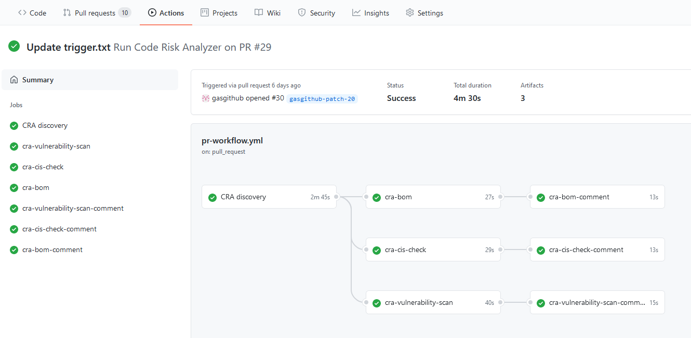
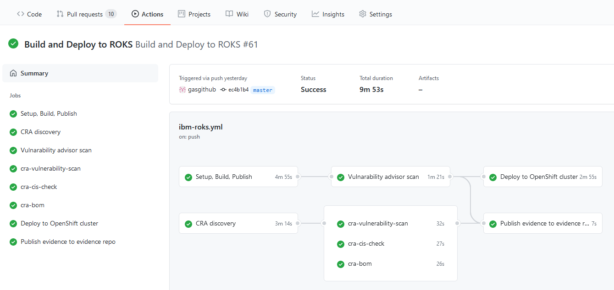

# This folder contains GitHub Actions workflows

Workflows are used to build and deploy `trader` service to OpenShift cluster.
They are also using *Code Risk Analyzer* and *Security Compliance* services available  in IBM Cloud.

This document describes neccessary steps that must be done before running the workflows.

Prerequisities:
 - IBM Cloud account 
 - Toolchain in IBM DevOps 
 - git repo for storing 'evidence'
 - IBM GHE repo (current limitation of the SCC integration tool)

 Detailed instructions how to set these up is in coresponding sections.

## Disabling/enabling workflows
Disabling a workflow allows you to stop a workflow from being triggered without having to delete the file from the repo.  
Temporarily disabling a workflow can be useful in some scenarios, for example:

- A workflow error that produces too many or wrong requests, impacting external services negatively.
- A workflow that is not critical and is consuming too many minutes on your account.
- A workflow that sends requests to a service that is down.

To disable workflow go to `Actions`, select given workflow, click `...` menu and click `Disable workflow`.
In similar way you can reenable the workflow later.

For more details check - [Disabling and enabling a workflow](https://docs.github.com/en/actions/managing-workflow-runs/disabling-and-enabling-a-workflow)

 # Workflows descriptions
There are 2 workflows defined in this repo:
- Run Code Risk Analyzer on PR workflow - in pr-workflow.yaml file
- Build and Deploy to ROKS workflow - in ibm-roks.yaml file

## Run Code Risk Analyzer on PR workflow
This workflow is triggered when developer creates new pull request with the changes that he wants to add to master branch.

Workflow is using [IBM Code Risk Analyzer](https://www.ibm.com/cloud/blog/announcements/find-source-code-vulnerabilities-with-code-risk-analyzer) service to scan source code, and find vulnerabilities in particular:
- your application dependencies (Python, Node.js, Java) 
- application containers - it scans images using static analysis without a need to run their container
- your Kubernetes deployment files based on industry standards and community best practices
- generates a Bill-of-Materials (BoM) accounting for all the dependencies and their sources for your application

Result form the analysis are added as pull request comments allowing to make jugement decision whether or not change can be merged to the master branch.

## Build and Deploy to ROKS workflow
This workflow is triggered when change is commited to the master branch (either directly or via megre of the pull request).

Primary function of this workflow is to build and deploy service, in addition it runs VA scan, CRA checks and publishes evidences of these steps to the 'evidence repo'.

Steps in the workflow:
- build application
- build docker image and publish to IBM Container Registry
- perform VA scan
- perform CRA checks
- publish CRA checks evidences
- deploy application to OCP cluster

# Detailed setup guide
TBD

## Configuration parmeters
Workflows are using some environment parameters, they are defined as GitHub secrets in your repository.
To create these parameters go to `Settings` tab in your repo, and then go to `Secrets`. Click `New repository secret` button to create secret.

Following parameters are required:
- `IBM_CLOUD_API_KEY` - your IBM Cloud API key
- `TOOLCHAIN_ID` - CRN of the toolchain defined in IBM Cloud
- `ICR_NAMESPACE` - namespece in IBM Container Registry
- `IKS_CLUSTER` - name of your OpenShift cluster in IBM Cloud
- `EVIDENCE_REPO` - path of your evidence repo e.g. `gituser/evidence-repo`
- `PUSH_TOKEN` - token used to publish to evidence repo

