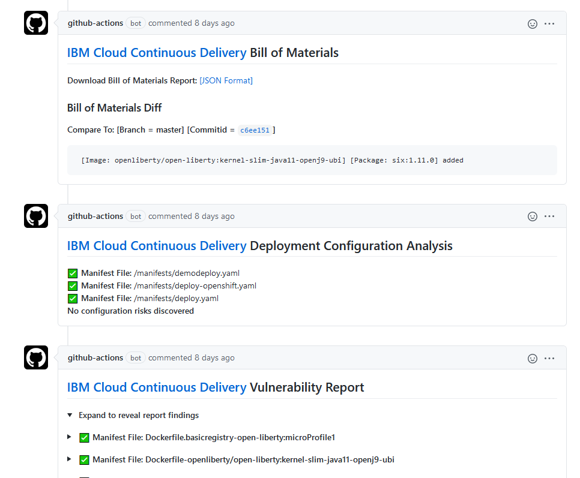
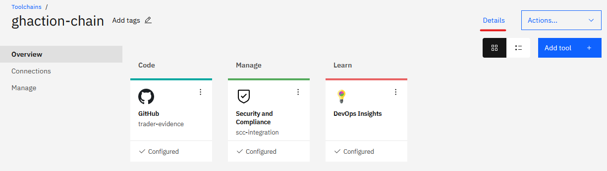

# This folder contains GitHub Actions workflows

Workflows are used to build and deploy `trader` service to OpenShift cluster.
They are also using *Code Risk Analyzer* and *Security Compliance* services available  in IBM Cloud.

This document describes neccessary steps that must be done before running the workflows.

Prerequisities:
 - IBM Cloud account 
 - Toolchain in IBM DevOps 
 - git repo for storing 'evidence'

 Detailed instructions how to set these up is in coresponding sections.

 # Workflows descriptions
There are 2 workflows defined in this repo:
- Run Code Risk Analyzer on PR workflow - in pr-workflow.yaml file
- Build and Deploy to ROKS workflow - in ibm-roks.yaml file

## Run Code Risk Analyzer on PR workflow
This workflow is triggered when developer creates new pull request with the changes that he wants to add to master branch.

Workflow is using [IBM Code Risk Analyzer](https://www.ibm.com/cloud/blog/announcements/find-source-code-vulnerabilities-with-code-risk-analyzer) service to scan source code, and find vulnerabilities in particular:
- In your application dependencies (Python, Node.js, Java)
- In application containers - it scans images using static analysis without a need to run the container
- In your Kubernetes deployment files based on industry standards and community best practices
- It also generates a Bill-of-Materials (BoM) accounting for all the dependencies and their sources for your application and stores in the IBM Cloud DevOps Insights service

Result from the analysis are added as pull request comments allowing to make judgment decision whether change can be merged to the master branch.

## Build and Deploy to ROKS workflow
This workflow is triggered when change is committed to the master branch (either directly or via merge of the pull request).

Primary function of this workflow is to build and deploy service, in addition it runs VA scan, CRA checks and publishes evidences of these steps to the 'evidence repo'.

Steps in the workflow:
- build application
- build docker image and publish to IBM Container Registry
- perform VA scan
- perform CRA checks
- publish CRA checks evidences
- deploy application to OCP cluster

# Detailed setup guide
This section contains all required steps to configure and run above workflows.

## Fork trader repo
Fork trader repository to your github account.

## Create repo for evidences
Create new repository where the evidences will be stored. This repo will be read by the SCC integration tool during security scans.
When creating, initialize repo with README file.

## Setup toolchain in IBM Cloud

For now, to integrate your GitHub Actions workflow with IBM SCC and IBM CRA you need toolchain defined in the IBM DevOps service.
Login to IBM Cloud – https://cloud,ibm.com

### Check for Continuous Deliver service
IBM Toolchains rely on Continuous Delivery service. You need to have one configured on your account that is located in Dallas. To check your services access Resource list from the ‘hamburger menu’ , and type “Continuous” in filter as shown below (verify that location is Dallas)

If you don’t have service or it is not in Dallas create new one.

### Create Continuous Deliver service
In the Resource list page click `Create resource +` button.  
In the Catalog page, in search filter start typing `Contin..` and hit enter to limit displayed services.  
Click Continuous Delivery tile.  
Create the service, select Dallas location and Lite (free) plan.  
Click Create button.   

### Create Toolchain
Once the Continuous Delivery service is created you can create the toolchain.  
From ‘hamburger’ menu select DevOps.  
Select `Dallas` location and click `Create toolchain`  
From template list select “Build your own toolchain”, give a name for chain and click Create

### Build Toolchain
Once the toolchain is created you need to add integration tools to it.

Click `Add tool + ` button, to add following tools:  
1.	GitHub – this will represent our evidence repo  
Provide parameters for the repository integration:
-	Existing repository
-	Your evidence repository url
-	Uncheck Issues and Tracking

After you click “Create Integration” button you might be asked to provide authorization for GitHub repo, if GitHub is not already authorized in your IBM Cloud account.

2.	DevOps Insights – this tool is required for integration with Code Risk Analysis tool. There is no additional parameters for this tool.

3.	Security and Compliance – this tool is required for integration with IBM Security Compliance Center
Provide:
-	Name for the tool – e.g. scc-integration
-	Evidence repo URL – e.g. https://github.com/gasgithub/trader-evidence

Here is how your toolchain should look like:

Click `Details` link and make a note of your:
-	toolchain ID – in this case it is 9bc7232c-25b7-4c82-8df9-2c0250f2b12e 
-	CRN - crn:v1:bluemix:public:toolchain:us-south:a/b71ac2564ef0b98f1032d189795994dc:9bc7232c-25b7-4c82-8df9-2c0250f2b12e::

## Configure GitHub Actions workflows
Configure the following parameters (secrets) in your cloned trader repository. To create secrets, select “Settings” tab in your repo and click “Secrets” in the left menu.  
Use “New repository secrets” button to create following secrets:
-	EVIDENCE_REPO – URL to evidence repository
-	PUSH_TOKEN – token to access evidence repository
-	IBM_CLOUD_API_KEY – your API KEY
-	ICR_NAMESPACE – your namespace in the IBM Container Registry service
-	IKS_CLUSTER – name of your OpenShift cluster in IBM Cloud
-	TOOLCHAIN_CRN – toolchain crn got from previous step
-	TOOLCHAIN_ID – toolchain id got from previous step

## Configure Security Compliance Center in IBM Cloud
Detailed SCC configuration is out of scope of this document, please refer to other guide which describes that in more details.  
Here we only mention settings relevant to the toolchain integration.

1.	Scope - Inventory  
Make sure your scope configuration includes “Developer Tools”

2.	Scope – credentials
Make sure that credential that is used during the scan has proper Git authorizations.
To check Git authorizations, log in to IBM Cloud using configured credential and access this link: https://cloud.ibm.com/devops/git?env_id=ibm:yp:us-south

If you don’t have authorization for GitHub, EDIT the following link with your github userid and repo: https://cloud.ibm.com/devops/setup/deploy?repository=https%3A%2F%2Fgithub.com%YOUR_GIT_ID%2FYOUR_EVIDENCE_REPO_NAME&env_id=ibm%3Ayp%3Aus-south&source_provider=githubconsolidated

3.	Profile
Ensure that Continuous Compliance goals are included in your scan profile.  

# Test your configuration
In this section you will test the whole configuration

## Test Run Code Risk Analyzer on PR workflow
To test PR workflow you need to create a pull request.

Modify any file in your forked trader repository, for example README.md, when saving changes instead of committing directly to master branch create a new branch and pull request. You can customize branch name (pr-workflow-test) or accept the default generated name.

Click “Propose changes” and click “Create pull request” on the next page.

Once you create pull request, the pull request page is opened and you can see checks being done.

Meanwhile you can open Actions page and observe your workflow progressing.

Once the workflow is finished you can check back pull request for comments added by the Code Risk Analyzer tool.

Your pull request workflow was successfully executed.

Click “Merge pull request” to merge the changes to the master branch and start build and deploy workflow

## Test Build and Deploy to ROKS workflow
If you followed this guide and first tested PR workflow your build and deploy workflow should be already started and running as a result of the merge you did.

If you didn’t create a pull request, you can just edit any file (for example README.md) and this time commit directly to the master branch. This will trigger build and deploy workflow also.

Go to the Actions page to follow progress of the workflow. Check if “Publish evidence…” job ended successfully, as it publishes to your evidence repo.

Verify that summary.json was created in your evidence repo. It will be located in the /raw/cd/unique-id-number folder (look at the latest modification time).  
Your workflow executed successfully and generated evidence for SCC.

# Invoke SCC scan to see data generated by workflow
Login to IBM Cloud and select “Security and Compliance” from hamburger menu.

Click Configure > Scope > your-scope-name to access scope settings page.

From Actions menu select Scan, and create new Validation scan, selecting your configured profile.  
Once scan is finished access its results via Access > Scans > your-scan-your-profile.
Switch to Resource tab and click your toolchain name.  
You will see configured goals crossed with gathered evidences, with green (success), red (failed), yellow (no evidence) information about your workflow execution.  

Great work! You successfully configured and tested GitHub Actions workflow that works with IBM Cloud Code Risk Analyzer and Security and Compliance services.  

# Appendix - Disabling/enabling workflows
Disabling a workflow allows you to stop a workflow from being triggered without having to delete the file from the repo.  
Temporarily disabling a workflow can be useful in some scenarios, for example:

- A workflow error that produces too many or wrong requests, impacting external services negatively.
- A workflow that is not critical and is consuming too many minutes on your account.
- A workflow that sends requests to a service that is down.

To disable workflow go to `Actions`, select given workflow, click `...` menu and click `Disable workflow`.
In similar way you can reenable the workflow later.

For more details check - [Disabling and enabling a workflow](https://docs.github.com/en/actions/managing-workflow-runs/disabling-and-enabling-a-workflow)
