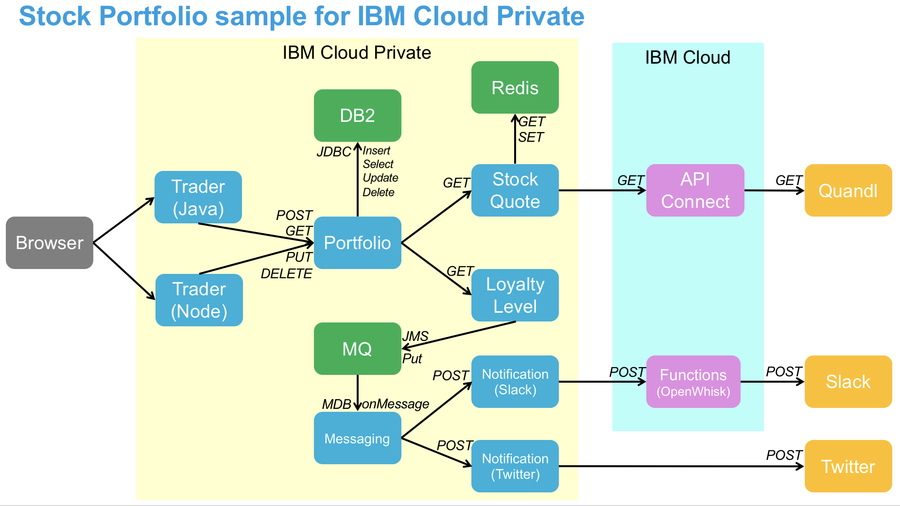

<!--
       Copyright 2017 IBM Corp All Rights Reserved

   Licensed under the Apache License, Version 2.0 (the "License");
   you may not use this file except in compliance with the License.
   You may obtain a copy of the License at

       http://www.apache.org/licenses/LICENSE-2.0

   Unless required by applicable law or agreed to in writing, software
   distributed under the License is distributed on an "AS IS" BASIS,
   WITHOUT WARRANTIES OR CONDITIONS OF ANY KIND, either express or implied.
   See the License for the specific language governing permissions and
   limitations under the License.
-->

The **trader** microservice provides the UI for the *Stock Trader* sample.  It calls the **portfolio** microservice,
which then calls various other services as needed.  It uses the *mpRestClient* to make the call, and passes a JWT on the
request, which **portfolio** checks for via *mpJwt*.



The main entry point is the **summary** servlet, which lets you choose an operation and a portfolio to act upon.  It
transfers control to other servlets, such as **addPortfolio**, **viewPortfolio**, and **addStock**, each of which
transfers control back to **summary** when done.  The **viewPortfolio** and **addStock** servlets expect a query param
named *owner*.

Each page has a header and footer image, and there's an index.html that redirects to the **summary** servlet.

The servlets just concern themselves with constructing the right **HTML** to return.  The UI is very basic; there
is no use of **JavaScript** or anything fancy.  All of the real logic is in the PortfolioServices.java, which
contains all of the REST calls to the Portfolio microservice, and appropriate JSON wrangling.

You can hit the main entry point by entering a URL such as `http://localhost:9080/trader/summary` in your
browser's address bar.  Or in a Kubernetes environment, you'd replace `localhost` with your proxy node address, and
`9080` with your node port or ingress port.  You also need to use `https` if using the IBMid version.

This is version 1 of the *Stock Trader* UI, implemented in **Java**, and is deliberately simplistic.  See the
**tradr** sibling repository for an alternate, more professional-looking version, implemented in **JavaScript** and **Vue**.

 ### Prerequisites for ICP Deployment
 This project requires two secrets: `jwt` and `oidc`.  You create these secrets by running:
  ```bash
  kubectl create secret generic jwt -n stock-trader --from-literal=audience=stock-trader --from-literal=issuer=http://stock-trader.ibm.com
  
  kubectl create secret generic oidc -n stock-trader --from-literal=name=<OIDC_CLIENT_ID> --from-literal=issuer=<OIDC_ISSUER> --from-literal=auth=<OIDC_AUTH_ENDPOINT> --from-literal=token=<OIDC_TOKEN_ENDPOINT> --from-literal=id=<OIDC_CLIENT_ID> --from-literal=secret=<OIDC_CLIENT_SECRET> --from-literal=key=<OIDC_CERTIFICATE> --from-literal=nodeport=https://<TRADER_HOSTNAME>:<TRADER_HOSTPORT>
  
  # Example oidc:
  kubectl create secret generic oidc -n stock-trader --from-literal=name=blueLogin --from-literal=issuer=https://iam.toronto.ca.ibm.com --from-literal=auth=https://iam.ibm.com/idaas/oidc/endpoint/default/authorize --from-literal=token=https://iam.ibm.com/idaas/oidc/endpoint/default/token --from-literal=id=N2k3kD3kks9256x3 --from-literal=secret=I33kkj2k330023 --from-literal=key=idaaskey --from-literal=nodeport=https://10.42.95.159:32389
  ```
  
  You'll also need to enable login to the IBM Cloud Private internal Docker registry by following
  [these steps](https://www.ibm.com/support/knowledgecenter/en/SSBS6K_3.1.2/manage_images/configuring_docker_cli.html).
  Don't forget to restart Docker after adding your cert.  On macOS you can restart Docker by running:
  ```bash
  osascript -e 'quit app "Docker"'
  open -a Docker
  ```
 
 ### Build and Deploy to ICP
To build `trader` clone this repo and run:
```bash
mvn package
docker build -t trader .
docker tag trader:latest <ICP_CLUSTER>.icp:8500/stock-trader/trader:latest
docker push <ICP_CLUSTER>.icp:8500/stock-trader/trader:latest
```

Use WebSphere Liberty helm chart to deploy Trader microservice to ICP:
```bash
helm repo add ibm-charts https://raw.githubusercontent.com/IBM/charts/master/repo/stable/
helm install ibm-charts/ibm-websphere-liberty -f <VALUES_YAML> -n <RELEASE_NAME> --tls
```

In practice this means you'll run something like:
```bash
docker build -t trader .
docker tag trader:latest mycluster.icp:8500/stock-trader/trader:latest
docker push mycluster.icp:8500/stock-trader/trader:latest

helm repo add ibm-charts https://raw.githubusercontent.com/IBM/charts/master/repo/stable/
helm install ibm-charts/ibm-websphere-liberty -f manifests/trader-values.yaml -n trader --namespace stock-trader --tls
```
